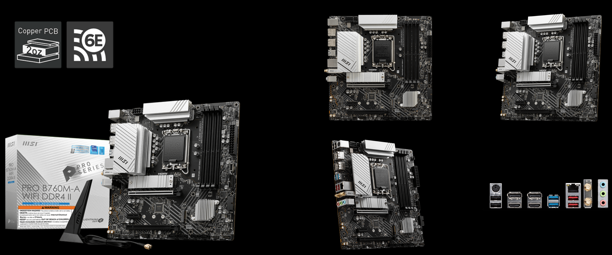
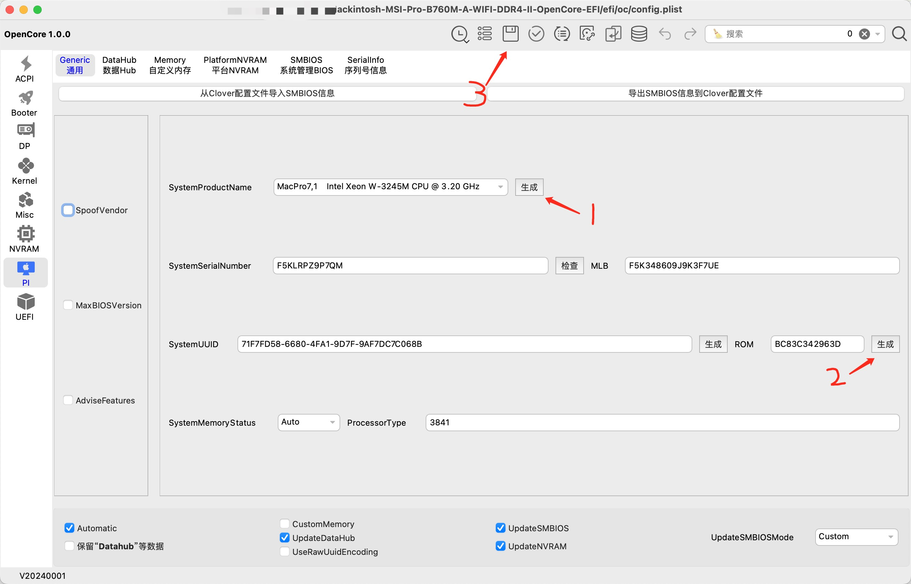

# Hackintosh MSI Pro B760M-A WIFI DDR4 II OpenCore EFI

### 硬件

| 组件         | 规格                                                                        |
| ------------ | --------------------------------------------------------------------------- |
| 主板         | 微星 MSI Pro B760M-A WIFI DDR4 II (2 Gen)                                   |
| 处理器       | Intel i5-12600KF                                                            |
| 显卡         | 技嘉 Radeon RX 6600 XT Gaming OC 8G (Display as AMD Radeon Pro W6600X 8 GB) |
| 内存         | 金百达银爵 KINGBANK 64GB DDR4 3600 Mhz (32GBx2 XMP 4000Mhz)                 |
| MacOS 硬盘   | 海康威视 HIKVISION C2000 Pro 1TB                                            |
| Windows 硬盘 | 凯侠 SD10 1TB (KIOXIA EXCERIA PLUS G3)                                      |
| 声卡         | 板载瑞昱 Realtek ALC897                                                     |
| 有线网卡     | 板载瑞昱 Realtek RTL8125BG 2.5GbE LAN                                       |
| 无线网卡     | 板载英特尔 Intel AX211 WIFI6E                                               |

### 其他

- 显示器: 4k
- 电源: 650w

### 系统固件版本

| 组件     | 版本                                                | 备注                                                                                     |
| -------- | --------------------------------------------------- | ---------------------------------------------------------------------------------------- |
| BIOS     | 7D99v1A (2024-04-23)                                | [主板官方产品规格介绍](https://www.msi.cn/Motherboard/PRO-B760M-A-WIFI-DDR4-II/Overview) |
| OpenCore | [1.0.2](https://github.com/acidanthera/OpenCorePkg) | 2024-10-16                                                                               |
| macOS    | Sonoma 14.5 (23F79)                                 | [第三方 DMG 镜像下载](https://hackintosh.club/d/10000080)                                |

> BIOS 更新：
> | 日期 | 版本 | 更新内容 |
> |------|------|----------|
> | 2024-09-06 | 7D99v1C | 更新 CPU Microcode 0x129 |
> | 2024-08-01 | 7D99v1B | 更新 CPU Microcode 0x125 |
>
> 注：12 代 CPU 不需要 13 14 代的微码更新拯救缩肛所以我没有升级，建议根据你的 CPU 型号酌情升级。

### BIOS 设置

| 设置项   | 路径                                | 值       |
| -------- | ----------------------------------- | -------- |
| 安全启动 | Settings -> Security -> Secure Boot | Disabled |
| D.T.M    | Search -> D.T.M                     | Enabled  |

### 驱动列表

| 系统    | 软件                                                                                   | 说明                                              |
| ------- | -------------------------------------------------------------------------------------- | ------------------------------------------------- |
| macOS   | [OpenRGB](https://gitlab.com/CalcProgrammer1/OpenRGB)                                  | RGB 灯效控制软件，支持 MSI 主板 ARGB 风扇灯效控制 |
| Windows | [官方驱动软件](https://www.msi.cn/Motherboard/PRO-B760M-A-WIFI-DDR4-II/support#driver) | 主板官方驱动下载                                  |

### 使用说明

> 必须按说明生成你自己系统的序列号，否则可能影响 Apple 云服务的使用

1. 在 [Release](https://github.com/xxnuo/Hackintosh-MSI-Pro-B760M-A-WIFI-DDR4-II-OpenCore-EFI/releases) 下载最新的 `EFI.zip` 文件
2. 解压下载的 `EFI.zip` 文件到桌面
3. 下载并解压 [OCAuxiliaryTools](https://github.com/ic005k/OCAuxiliaryTools/releases)
4. 打开 OCAuxiliaryTools，点击菜单栏的 `文件/打开`，选择 `桌面/EFI/OC/config.plist`
5. 选择左侧的 `PI` 选项卡，然后依次点击 1、`生成`；2、`生成`、3、`保存`
   
6. 关闭 OCAuxiliaryTools
7. **复制桌面上的 EFI 文件夹到你要安装 macOS 的硬盘的第一个引导分区根目录**
8. **复制桌面上的 EFI 文件夹到你用 DMG 镜像做好的安装 U 盘的第一个引导分区根目录**
9. 重启插上你用 DMG 镜像做好的安装 U 盘，进 BIOS 选择 U 盘启动，按步骤安装。
10. 安装完成后，拔掉安装 U 盘，重启即可进入系统。
